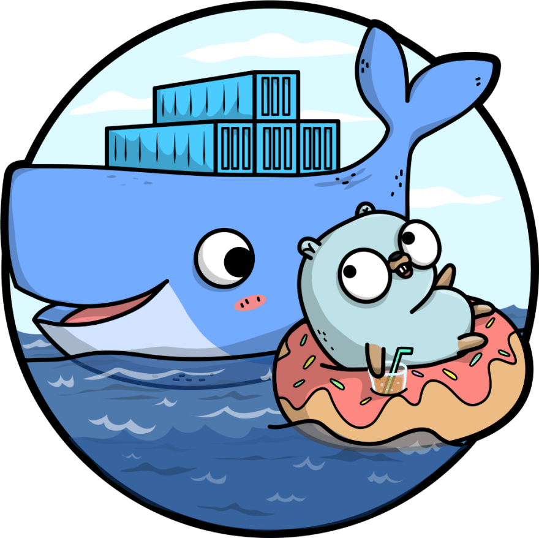

# golang-playground

Boilerplate to use Golang with Docker

## Need To Run

- Docker
- Docker Compose

## Setup

- Start project run command `docker-compose up`
- Open http://localhost:3030/

## ToDo

- [ ] Add live reload
- [ ] Write tests to practice
